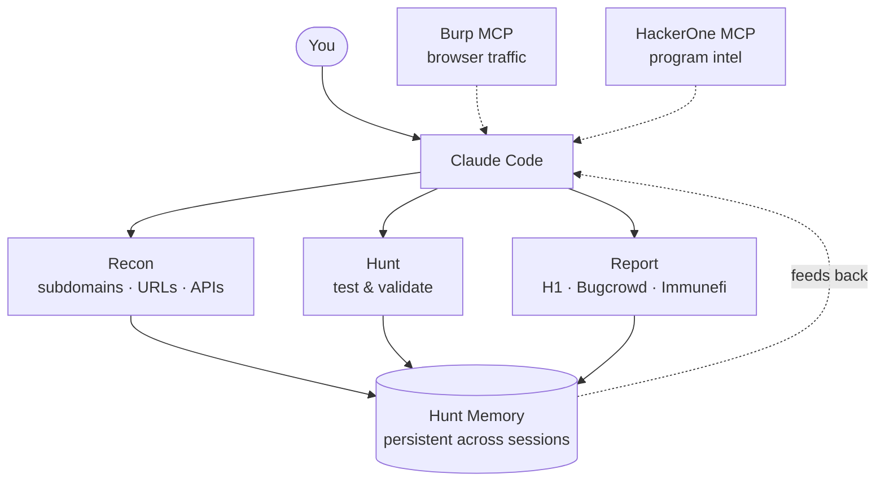

<p align="center">
  
</p>

<div align="center">


# Claude Bug Bounty

### Find security vulnerabilities, get paid — with AI doing the heavy lifting

*Your AI hunting partner that remembers past targets, spots vulnerabilities, and writes reports for you.*

<sub>by <a href="https://shuvonsec.me">shuvonsec</a></sub>

<br>

[](LICENSE)
[](https://python.org)
[](tests/)
[](https://claude.ai/claude-code)
[](https://opencode.ai)
[](https://pi.dev)
[](#contributing)

<br>

<a href="#-what-is-this">What Is This?</a>&nbsp;&nbsp;·&nbsp;&nbsp;<a href="#-quick-start">Quick Start</a>&nbsp;&nbsp;·&nbsp;&nbsp;<a href="#-commands">Commands</a>&nbsp;&nbsp;·&nbsp;&nbsp;<a href="#-whats-new">What's New</a>&nbsp;&nbsp;·&nbsp;&nbsp;<a href="#-installation">Install</a>&nbsp;&nbsp;·&nbsp;&nbsp;<a href="FAQ.md">FAQ</a>&nbsp;&nbsp;·&nbsp;&nbsp;<a href="TERMS.md">Terms</a>

<br>


<sub>Burp MCP &nbsp;·&nbsp; Caido MCP &nbsp;·&nbsp; HackerOne MCP &nbsp;·&nbsp; Auth-aware hunting &nbsp;·&nbsp; Autonomous mode</sub>

</div>

<br>

## What Is This?

**Bug bounty hunting** is when companies pay you real money to find security vulnerabilities in their websites and apps before bad actors do. Platforms like HackerOne and Bugcrowd connect hunters with companies. Payouts range from $100 to $1,000,000+ depending on severity.

**This tool** is a plugin for [Claude Code](https://claude.ai/claude-code) (Anthropic's AI coding assistant) that turns it into a professional bug bounty hunting partner. It also ships portable Agent Skills and command prompts for OpenCode, Pi Agent, Codex-style harnesses, and shared `.agents/skills` setups. Instead of juggling 15 different tools and writing reports from scratch, you just type a command and the AI handles the rest.

**In plain terms:**
- You give it a target website
- It automatically scans the site, finds vulnerabilities, validates they're real, and writes a professional report
- It remembers what you found on past targets and applies that knowledge to new ones
- You can even put it on autopilot and let it hunt on its own while you sleep

**Who is it for?**
- Security researchers who want to move faster
- Bug bounty hunters who are tired of the manual grind
- People learning security who want AI guidance at every step

<br>

## Before vs. After

Most hunters waste hours on things that shouldn't take that long. Here's the shift:

| Before | After |
|:---|:---|
| Run 10+ tools manually, hope for the best | AI orchestrates everything in the right order |
| Write reports from scratch (45 min each) | `report-writer` agent generates submission-ready reports in 60s |
| Forget what worked last month | **Memory system** — patterns from target A inform target B |
| Submit bugs without proper validation | **7-Question Gate** kills weak findings before you waste time reporting |
| Can't see live browser traffic | **Burp MCP** or **Caido MCP** — AI reads your proxy history in real time |
| Hunt one endpoint at a time | **`/autopilot`** runs the full hunt loop while you watch |
| Anonymous recon misses auth-only bugs | **Auth-aware pipeline** — set a session once, httpx/katana/ffuf/nuclei all carry it |

<br>

## Quick Start

> **Prerequisite:** You need [Claude Code](https://claude.ai/claude-code) installed and a Claude **Pro** or **Max** plan (or an Anthropic API key with credit). Claude Code itself is free to install, but the underlying model usage requires a paid plan or API billing — the free Claude.ai web account does not include Claude Code access.

### Way 1 — Just ask Claude to install it (recommended)

Open your terminal, run `claude`, and paste this prompt. Claude does the rest:

```text
Help me install the Claude Bug Bounty toolkit from
https://github.com/shuvonsec/claude-bug-bounty into ~/tools/.

Steps:
1. git clone the repo into ~/tools/claude-bug-bounty
2. cd into it and run ./install_tools.sh   (scanners: subfinder, httpx, nuclei, gau, katana, ffuf, dnsx, nmap)
3. then run ./install.sh                   (registers the AI skills + 23 slash commands into ~/.claude/)
4. verify the install by listing the new commands (/recon, /hunt, /validate, /report, /autopilot)
   and confirming the bug-bounty + web2-recon + report-writing skills are available
5. if anything fails (Go missing, Python pkg, brew formula), tell me exactly which tool
   broke and the one-line fix — don't silently skip it

I'm on macOS / Linux. Use brew or apt as needed. Don't sudo unless I approve.
```

That's it. Claude reads the repo, runs the installers, surfaces any failures, and tells you when you're ready to hunt.

### Way 2 — Manual install (if you prefer to drive)

```bash
git clone https://github.com/shuvonsec/claude-bug-bounty.git
cd claude-bug-bounty
chmod +x install_tools.sh && ./install_tools.sh   # installs scanning tools (subfinder, httpx, nuclei...)
chmod +x install.sh && ./install.sh               # installs AI skills + commands into Claude Code
```

If you only need the Python helpers or want to run tests:

```bash
python3 -m pip install -r requirements.txt
```

### Other Agent Harnesses

The installer can target the common skill/command locations used by other AI coding agents:

```bash
./install.sh --agent opencode          # ~/.config/opencode/skills + commands + agents
./install.sh --agent pi                # ~/.pi/agent/skills + prompt templates
./install.sh --agent codex             # ~/.codex/skills + commands
./install.sh --agent agents            # ~/.agents/skills shared by OpenCode and Pi
./install.sh --agent opencode --project # .opencode/ in this repo only
./install.sh --agent pi --project       # .pi/ in this repo only
./install.sh --agent all                # install every supported global target
```

OpenCode reads `AGENTS.md` from the project root and discovers skills in
`.opencode/skills`, `~/.config/opencode/skills`, `.agents/skills`, and
`~/.agents/skills`. Pi discovers skills from `.pi/skills`, `~/.pi/agent/skills`,
`.agents/skills`, and `~/.agents/skills`, and exposes command prompts from
`.pi/prompts` or `~/.pi/agent/prompts`.

<br>

### Start hunting — paste-ready prompts

Open `claude` in your terminal and paste any of these. They work as natural-language prompts (no slash commands needed) and let Claude pick the right tools, agents, and gates for the job.

**Recon** — map the target

```text
Run recon on target.com — subdomain enum, live host probing, URL crawling,
tech fingerprinting, and a focused nuclei sweep. Save everything under
recon/target.com/. Skip any external tool that isn't installed and tell me
what to install to close the gap.
```

**Hunt** — test for bugs

```text
Hunt target.com using the recon data already in recon/target.com/.
Prioritize the high-value classes first: IDOR/BOLA, auth bypass, SSRF,
mass assignment, OAuth/OIDC, business logic. Skip anything informational.
Pause before any active POST/PUT/DELETE so I can approve.
```

**Validate** — pre-report gate

```text
I think I found a [VULN_CLASS] on [ENDPOINT/PARAM]. Walk it through the
7-Question Gate and the 4 validation gates from skills/triage-validation/.
If it can't clearly pass all 7, kill it — I'd rather drop a maybe than
tank my N/A ratio on the platform.
```

**Report** — submission-ready writeup

```text
Write a submission-ready report for the finding I just validated.
Platform: [HackerOne / Bugcrowd / Intigriti / Immunefi].
Use the impact-first template: title formula, one-line impact statement,
exact repro steps, request/response PoC, CVSS 3.1 vector + score,
suggested fix. Human tone — no AI-slop hedging like "could potentially".
```

**Autopilot** — full loop, hands off

```text
Run autopilot on target.com in --normal mode. Take it end-to-end:
scope check → recon → attack-surface ranking → hunt → validate → report.
Pause at each gate so I can sanity-check before you spend more credits.
Log everything to hunt-memory so I can resume later.
```

**Pickup** — resume a previous hunt

```text
Pick up where I left off on target.com. Read hunt-memory/, show me
untested endpoints from last session, and start with the highest-ranked
ones I haven't touched. Don't re-run recon unless it's older than 7 days.
```

**Smart contract audit (web3)**

```text
Audit the Solidity contract at [path/to/Contract.sol]. Walk all 10 DeFi
bug classes from skills/web3-audit: reentrancy, oracle manipulation,
access control, accounting desync, flash loan, signature replay, ERC4626
share inflation, off-by-one, incomplete code paths, proxy/upgrade.
For any finding, drop a Foundry PoC using the template in that skill.
```

**Meme-coin / token rug-pull scan**

```text
Scan this token for rug-pull signals: [CHAIN] [contract-address].
Check mint authority, freeze authority, LP lock status, transfer-tax
manipulation, honeypot patterns, bonding-curve exploits, and
proxy/admin keys. Tell me straight: ape, watch, or avoid.
```

**Scope check** — before you touch anything

```text
Is [asset.example.com] in scope for the [program-name] bug bounty
program on [HackerOne/Bugcrowd/Intigriti/Immunefi]? Pull the live
policy, check in-scope / out-of-scope lists, flag any caveats
(no automated scanners, no DoS, prod-only, etc.) before I send a
single request.
```

**Intel** — what's already known about this target

```text
Pull intel on target.com: relevant CVEs in their tech stack, disclosed
HackerOne / Bugcrowd reports against them or sibling products, recent
patches in their public repos, and any GitHub org I should be watching
for commit leaks.
```

> **Tip:** Each prompt is also wired to a slash command (`/recon`, `/hunt`, `/validate`, `/report`, `/autopilot`, `/pickup`, `/web3-audit`, `/token-scan`, `/scope`, `/intel`). Use whichever feels faster — prompts give you control, slash commands are muscle memory.

<br>

> **Don't use Claude Code?** Run the Python tools directly:
> ```bash
> python3 tools/hunt.py --target target.com
> ./tools/recon_engine.sh target.com
> ```

<br>

## How It Works

A team of specialists, each doing one job. Claude orchestrates; memory persists across sessions.



Run the whole loop, or any step on its own.

<br>

## Commands

### The Core 4 (start here)

| Command | Argument | What It Does | When |
|:---|:---|:---|:---|
| `/recon` | `target.com` | Maps subdomains, live pages, APIs, and runs basic scans | Always first |
| `/hunt` | `target.com` | Tests for vulns using the right technique per tech stack | After recon |
| `/validate` | — | 7-question check before you write the report | Pre-report |
| `/report` | — | Generates H1 · Bugcrowd · Intigriti · Immunefi report | Post-validation |

### Power Commands

| Command | What It Does |
|:---|:---|
| `/autopilot target.com` | AI runs the full loop autonomously — recon → hunt → validate → report |
| `/surface target.com` | Ranked list of the best places to test (informed by past findings) |
| `/pickup target.com` | Untested endpoints from last session — pick up where you left off |
| `/remember` | Saves the current finding or technique to memory for future use |
| `/intel target.com` | Pulls CVEs and disclosed reports relevant to this target |
| `/chain` | When you find bug A, finds the bugs B and C that usually come with it |
| `/scope <asset>` | Checks if a domain or URL is in scope before you test it |
| `/triage` | Quick 2-minute go/no-go check — keep investigating or move on? |
| `/web3-audit <contract>` | Full smart contract security audit, 10 bug class checklist |
| `/token-scan <contract>` | Scans a meme coin / token for rug pull signals (EVM + Solana) |
| `/memory-gc` | Inspect or rotate hunt-memory JSONL files (10 MB cap, keeps 3 backups) |

### Recon Toolkit (v4.3)

Thin wrappers over external tools. Each one is gated on tool presence — missing tools are skipped, not errors.

| Command | What It Does |
|:---|:---|
| `/scope-aggregate <program>` | Pulls every in-scope asset across H1 · Bugcrowd · Intigriti · YWH · Immunefi (bbscope + bounty-targets-data) |
| `/secrets-hunt --js-bundle <dir>` | Leaked credentials in source, JS bundles, or a GitHub org (trufflehog · noseyparker · gitleaks) |
| `/takeover --recon <dir>` | Subdomain takeover candidates from a recon run (dnsReaper · subjack) |
| `/cloud-recon --keyword <name>` | Public S3 · Azure · GCP buckets + CloudFlare-bypass origin IPs |
| `/param-discover <url>` | Hidden HTTP parameters (Arjun · x8) |
| `/bypass-403 <url>` | Header · method · encoding tricks against a 403/401 |
| `/scan-cves <host>` | Focused nuclei high/critical sweep + optional log4j-scan |
| `/arsenal [tool]` | Lists installed external tools or prints an install hint |

<br>

## AI Agents

8 specialized agents, each built for one job:

| Agent | What It Does |
|:---|:---|
| **recon-agent** | Finds all subdomains, live hosts, and URLs for a target |
| **report-writer** | Writes professional, impact-first reports that get paid |
| **validator** | Runs the 7-Question Gate — kills weak findings before you waste time |
| **web3-auditor** | Audits smart contracts for 10 common vulnerability classes |
| **chain-builder** | When you find one bug, finds the chain of related bugs |
| **autopilot** | Runs the whole hunt loop autonomously with safety checkpoints |
| **recon-ranker** | Ranks the attack surface so you test the highest-value targets first |
| **token-auditor** | Fast meme coin / token rug pull and security analysis |

<br>

## What's New

### v4.3.1 — Bug Fixes + Hardening (Jun 2026)

- **Scope checker CLI.** `tools/scope_checker.py` now has a deterministic command-line surface for asset checks, URL filtering, and JSON output.
- **Safer shell auth expansion.** `tools/recon_engine.sh`, `tools/vuln_scanner.sh`, and `scripts/full_hunt.sh` now use bash 3.2-safe auth array expansion so anonymous macOS runs do not abort under `set -u`.
- **Report persistence.** `tools/validate.py` now writes `submission-notes.md` and `validation.json` alongside each report draft, and the report-writing docs require saving those artifacts.
- **Dependency clarity.** `requirements.txt` now lists `requests` and `pytest`, and `install_tools.sh` tries to install them after the binary tooling pass.
- **CLI reliability.** `tools/hai_probe.py` and `tools/zendesk_idor_test.py` now show `--help` even when `requests` is missing, and fail with clear dependency errors instead of tracebacks.

### v4.3.0 — Auth Sessions + Recon Arsenal (May 2026)

- **Auth-aware hunting.** Set a session once (`--cookie`, `--bearer`, env vars, or `.private/target.json`) and every downstream tool that takes auth — httpx, katana, ffuf, nuclei, dalfox, the SQLi/SSTI/upload PoC probes — carries it. Most paying bugs (IDOR, BOLA, mass assignment, SSRF behind a login) only exist after login; the default pipeline used to miss them. See [`docs/auth-sessions.md`](docs/auth-sessions.md).
- **8 new commands.** `/scope-aggregate`, `/secrets-hunt`, `/takeover`, `/cloud-recon`, `/param-discover`, `/bypass-403`, `/scan-cves`, `/arsenal` — all under the **Recon Toolkit** table below.
- **External tool registry.** `tools/external_arsenal.sh` is the single source of truth for ~50 external tools (install hints, upstream URLs, `_have <tool>` helper). Replaces scattered `command -v` checks across the shell scripts.
- **Recon pipeline.** Optional nuclei phase in `recon_engine.sh` (off by default; gated on tool presence).
- **Methodology cheatsheet.** `skills/security-arsenal/METHODOLOGY_CHEATSHEET.md` distills per-vuln quick-check tables from HowToHunt + HolyTips + AllAboutBugBounty + KingOfBugBountyTips into one reference.

### v4.2.0 — Memory Rotation (Apr 2026)

- **Auto-rotation for hunt memory** — `audit.jsonl`, `patterns.jsonl`, and `journal.jsonl` no longer grow forever. Files rotate at 10 MB and keep 3 backups, fully transparent to writers (safe under `fcntl.LOCK_EX` for concurrent processes).
- **`/memory-gc`** — new slash command to inspect, force-rotate, or purge backup files in the hunt-memory tree.
- **22 new tests** covering rotation primitives, multi-process concurrent writes, and disk-full `OSError` propagation.

### v4.1.0 — Auto-Memory + README (Apr 2026)

- **Auto-memory at session end** — the AI now automatically logs what it tested and found after every hunt session. Memory used to stay empty until you manually ran `/remember`. Now the flywheel starts on day 1.
- README badge and stats updated, `install_tools.sh` added to Quick Start (was missing)
- `hunt-memory/` added to `.gitignore` (contains full URL history, shouldn't be committed)

### v4.0.0 — Meme Coin Security Module (Apr 2026)

- **`/token-scan <contract>`** — automated rug pull scanner for EVM and Solana tokens
- **`skills/meme-coin-audit/`** — 8 token bug classes: mint authority, freeze authority, LP locks, honeypot detection, bonding curve exploits, Solana SPL checks
- **New agent:** `token-auditor`

### v3.1.1 — CI/CD Scanner (Mar 2026)

- **GitHub Actions security scanning** built into the recon pipeline
- Auto-detects GitHub orgs from recon data and scans their workflow files
- 52 rules, 81.6% GHSA coverage — catches expression injection, secret leaks, supply chain attacks

<details>
<summary><b>Older releases (v3.1.0, v3.0.0, v2.x)</b></summary>
<br>

**v3.1.0 — Hunting Methodology Skill**
- `skills/bb-methodology/` — mindset + 5-phase non-linear workflow, decision trees per vuln class, 20-min rotation clock

**v3.0.0 — The Bionic Hunter**
- `/autopilot` — full autonomous hunt loop with `--paranoid`, `--normal`, `--yolo` modes
- Hunt memory — journal, pattern DB, target profiles, cross-target learning
- Burp MCP — AI reads your proxy history in real time
- HackerOne MCP — search disclosed reports, get program stats and policy
- `/intel`, `/pickup`, `/remember`, `/surface` commands

**v2.1.0 — 20 Vuln Classes**
- MFA/2FA bypass and SAML/SSO attacks added (classes 19 and 20)
- NoSQL injection, command injection, SSTI, HTTP smuggling, WebSocket payloads added to arsenal

</details>

<br>

## What It Can Find

<details>
<summary><b>20 Web2 Vulnerability Classes</b> — click to expand</summary>
<br>

These are the types of security bugs it looks for in regular websites and APIs:

| Vulnerability | What It Means | Typical Payout |
|:---|:---|:---|
| **IDOR** | Accessing another user's data by changing a number in the URL | $500 - $5K |
| **Auth Bypass** | Getting into accounts or admin panels without permission | $1K - $10K |
| **XSS** | Injecting malicious scripts into web pages | $500 - $5K |
| **SSRF** | Making the server fetch internal resources it shouldn't | $1K - $15K |
| **Business Logic** | Exploiting flaws in how the app is supposed to work | $500 - $10K |
| **Race Conditions** | Sending requests at the same time to get double rewards/credits | $500 - $5K |
| **SQL Injection** | Manipulating the database through user inputs | $1K - $15K |
| **OAuth/OIDC** | Breaking the "Login with Google/GitHub" flows | $500 - $5K |
| **File Upload** | Uploading malicious files that get executed | $500 - $5K |
| **GraphQL** | Auth bypass and data leaks through GraphQL APIs | $1K - $10K |
| **LLM/AI** | Prompt injection and IDOR in AI-powered features | $500 - $10K |
| **API Misconfig** | Mass assignment, JWT attacks, broken CORS | $500 - $5K |
| **Account Takeover** | Taking over someone else's account | $1K - $20K |
| **SSTI** | Template injection that leads to code execution | $2K - $10K |
| **Subdomain Takeover** | Claiming expired subdomains (GitHub Pages, S3, Heroku) | $200 - $5K |
| **Cloud/Infra** | Exposed S3 buckets, EC2 metadata, Firebase, Kubernetes | $500 - $20K |
| **HTTP Smuggling** | Confusing front-end and back-end servers to bypass security | $5K - $30K |
| **Cache Poisoning** | Poisoning CDN caches to serve malicious content to others | $1K - $10K |
| **MFA Bypass** | Getting past two-factor authentication | $1K - $10K |
| **SAML/SSO** | Breaking enterprise single sign-on implementations | $2K - $20K |

</details>

<details>
<summary><b>10 Web3 / Smart Contract Bug Classes</b> — click to expand</summary>
<br>

These are bugs in blockchain smart contracts, common on Immunefi:

| Vulnerability | What It Means | Typical Payout |
|:---|:---|:---|
| **Accounting Desync** | Contract's math gets out of sync with reality | $50K - $2M |
| **Access Control** | Functions that should be admin-only aren't | $50K - $2M |
| **Incomplete Code Path** | Edge cases that drain funds | $50K - $2M |
| **Off-By-One** | Math errors that let attackers take more than they should | $10K - $100K |
| **Oracle Manipulation** | Manipulating price feeds to exploit DeFi protocols | $100K - $2M |
| **ERC4626 Attacks** | Vault share inflation attacks | $50K - $500K |
| **Reentrancy** | Calling back into a contract before it finishes | $10K - $500K |
| **Flash Loan** | Using uncollateralized loans to manipulate prices | $100K - $2M |
| **Signature Replay** | Reusing signed transactions | $10K - $200K |
| **Proxy/Upgrade** | Exploiting upgradeable contract patterns | $50K - $2M |

</details>

<br>

## Installation

### What You Need First

```bash
# macOS
brew install go python3 node jq

# Linux (Ubuntu/Debian)
sudo apt install golang python3 nodejs jq
```

You also need [Claude Code](https://claude.ai/claude-code) installed and a **Claude Pro or Max plan** (or an Anthropic API key with credit). The free Claude.ai web account does not include Claude Code access — that's the model billing, not the CLI.

### Install — two ways

**A. Let Claude install it for you.** Open `claude` in your terminal and paste:

```text
Help me install the Claude Bug Bounty toolkit from
https://github.com/shuvonsec/claude-bug-bounty into ~/tools/. Clone the repo,
run ./install_tools.sh, then ./install.sh. Verify the /recon /hunt /validate
/report commands and the bug-bounty skill are registered. If anything breaks
(Go, Python, brew/apt), tell me which tool and the exact one-line fix.
```

**B. Drive it yourself:**

```bash
git clone https://github.com/shuvonsec/claude-bug-bounty.git
cd claude-bug-bounty
chmod +x install_tools.sh && ./install_tools.sh   # scanning tools (subfinder, httpx, nuclei, etc.)
chmod +x install.sh && ./install.sh               # AI skills + commands into Claude Code
```

### API Keys

<details>
<summary><b>Chaos API</b> (recommended for better subdomain discovery)</summary>
<br>

1. Sign up free at [chaos.projectdiscovery.io](https://chaos.projectdiscovery.io)
2. Add your key:

```bash
export CHAOS_API_KEY="your-key-here"
echo 'export CHAOS_API_KEY="your-key-here"' >> ~/.zshrc
```

</details>

<details>
<summary><b>Optional keys</b> (even better subdomain coverage)</summary>
<br>

Add to `~/.config/subfinder/config.yaml`:
- [VirusTotal](https://www.virustotal.com) — free
- [SecurityTrails](https://securitytrails.com) — free tier
- [Censys](https://censys.io) — free tier
- [Shodan](https://shodan.io) — paid

</details>

<br>

## The Rules (Always Active)

These apply every session, no exceptions:

```
 1. READ FULL SCOPE FIRST   — only test what the program says you can
 2. ONLY REAL BUGS          — "Can an attacker do this RIGHT NOW?" if no, stop
 3. KILL WEAK FINDINGS FAST — 30-second check saves hours of wasted reporting
 4. NEVER GO OUT OF SCOPE   — one wrong request can get you banned
 5. 5-MINUTE RULE           — no progress after 5 min? move to the next target
 6. VALIDATE BEFORE REPORT  — run /validate before you spend 30 min writing
 7. IMPACT FIRST            — start with the bugs that have the worst consequences
```

<br>

## Related Projects

| Repo | What It's For |
|:---|:---|
| **[claude-bug-bounty](https://github.com/shuvonsec/claude-bug-bounty)** | This — full hunting pipeline from recon to report |
| **[web3-bug-bounty-hunting-ai-skills](https://github.com/shuvonsec/web3-bug-bounty-hunting-ai-skills)** | Smart contract security — 10 bug classes, Foundry PoC templates |
| **[public-skills-builder](https://github.com/shuvonsec/public-skills-builder)** | Turns 500+ public bug writeups into Claude skill files |

<br>

## Contributing

PRs welcome. Best contributions:
- New vulnerability scanners or detection modules
- Payload additions to `skills/security-arsenal/SKILL.md`
- Real-world methodology improvements (with evidence from paid reports)
- Support for more platforms (YesWeHack, Synack, HackenProof)

```bash
git checkout -b feature/your-contribution
git commit -m "Add: short description"
git push origin feature/your-contribution
```

---

<div align="center">

### Connect

[GitHub](https://github.com/shuvonsec) &nbsp;·&nbsp; [Twitter](https://x.com/shuvonsec) &nbsp;·&nbsp; [LinkedIn](https://linkedin.com/in/shuvonsec) &nbsp;·&nbsp; [shuvonsec@gmail.com](mailto:shuvonsec@gmail.com)

<br>

**Built by bug hunters, for bug hunters.** &nbsp;·&nbsp; If this helped you find a bug, [leave a star ⭐](https://github.com/shuvonsec/claude-bug-bounty)

<br>

<sub>MIT License · For authorized security testing only. Test only within an approved bug bounty program scope. Never test systems without explicit written permission. Follow responsible disclosure.</sub>

</div>
